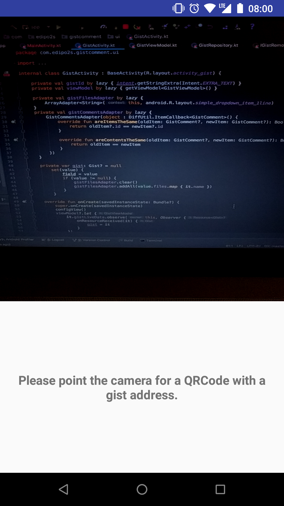
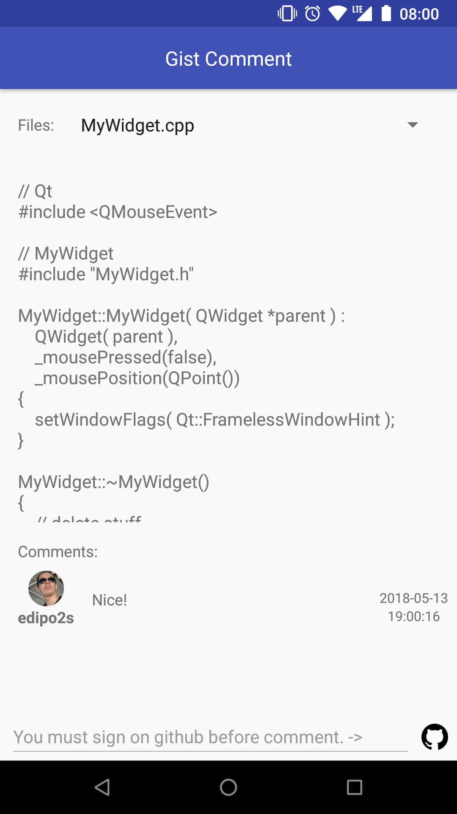
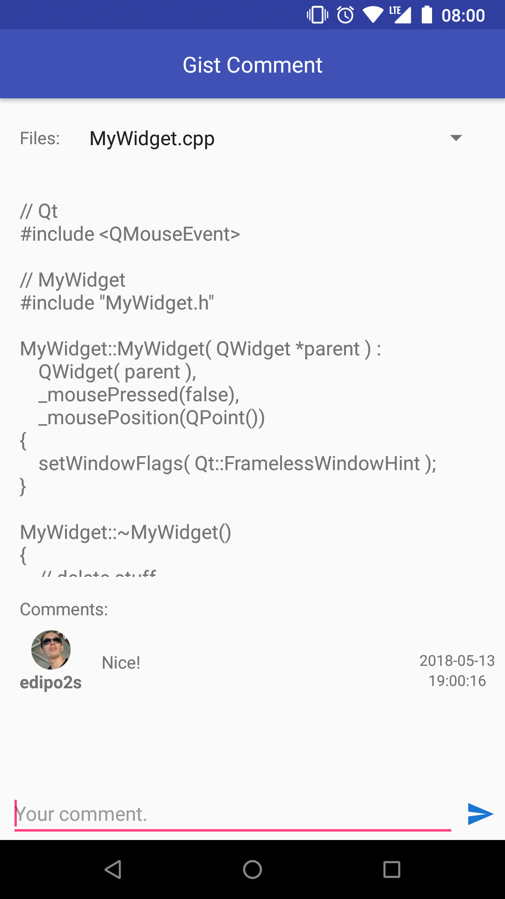

Android Gist Comment Test App
===================================

This app demonstrates how to use gist api to insert comment on a gist.
It was developed with Kotlin following MVVM architecture and using dependency injection

Introduction
------------

To open the gist the user needs to scan a QrCode that contains gist url.
Before user can comment the gist, a authentication is required.

Pre-requisites
--------------

- Android SDK 27
- Android Build Tools v27.0.2
- Gradle

Screenshots
-------------

 
 
 

Build
---------------

- Create a OAuthApp following the instructions of <a href="https://developer.github.com/apps/building-oauth-apps/creating-an-oauth-app/">**Creating an OAuth App**</a>
- Get the **Client Id** and **Client Secret** and set in **gradle.properties** file. Sample:
```
github_oauth_app_client_id=1a69b25592xxxxxxxxxx
github_oauth_app_client_secret=5a54e7e12bxxxxxxxxxxxxxxxxxxxxxxxxxxxxxx
```
- Build project using "**gradlew build**" command or use "**Import Project**" in Android Studio.
